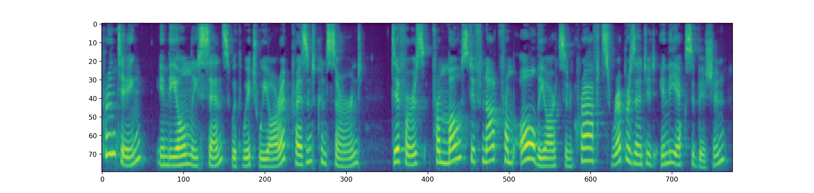
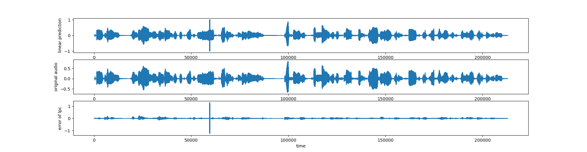

# Auorange: LPC prediction for audios using mel spectrogram

This repo contains codes that calculate linear prediction from mel spectrogram.

Can be used in Text to Speech vocoder like lpcnet or feather wave, etc.

## requirements

python3.5 or higher

## Run

Run this script to generate examples in wavs
```
python librosa_predict.py
```

## Results

Original audio is wavs/LJ001-0001.wav, which is the same as wavs/audio.wav.

### Librosa Feathre Extractor

Mel spectrogram are extracted using librosa.

Mel spectrogram is


Predicted audio, original audio and error between two of them are



## TODO:

- [ ] Add More comments
- [ ] Extract audio feature using tensorflow
- [ ] Extract audio feature using pytorch
